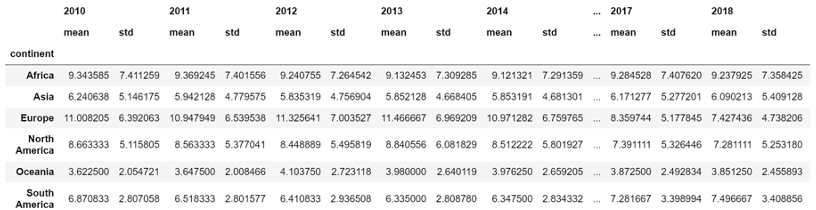

# Note: Mid Term Exam

Type: Lecture
Reviewed: No

Data Science for workflow

1. Data Collection and Storage -> Collect, Storage.
2. Data Preparation -> Cleaning, Organized, Reformat.
3. Exploration & Visualization -> Image, Graph.
4. Experimentation & Prediction -> Estimate, Forecast.

What do we need for machine learning?

1. A well-defined question.
2. A set of example data.
3. A new set of data to use our algorithm on.

Traditional machine learning -> Prediction, Cluster.

IOT -> Physical device.

Deep learning -> Image recognition, Language.

Data Engineer -> **Data Collection and Storage**.

- Build data flow, pipeline, storage system.
- SQL, Python, Java.

Data Analyst -> **Data Preparation and Exploration & Visualization**.

- SQL, Excel.

Data Scientist -> **Experimentation & Prediction and Data Preparation**.

- Statistical, traditional machine learning.
- Python, R.

Machine Learning Scientist -> **Prediction and Data Preparation**.

- Deep Learning, Prediction, Classification.
- Python, R.

Open data -> API, Government data, Public.

- Free data.

Company data -> Survey, customer data, logistics data, web events.

- data-driven decisions, not open data.

Quantitative data -> counted, measured, and numbers.

Qualitative data -> observed but not measured.

Unstructured –> text, video and audio files that are stored in database.

Structured –> Relational database such as MySQL.


Data pipelines -> **Transform & Load**.

- How de we keep it organized and easy to use?
  - Joining data sources into one data set.
  - Converting data structures to fit database schemas.
  - Removing irrelevant data.

Why prepare data?

- Real data is messy(Tidiness), Missing data, and Remove duplicates

Exploratory Data Analysis

- formulating hypotheses and assessing its main characteristics, with a strong emphasis on visualization.

What are experiments in data science?

- Experiments help drive decisions and draw conclusions.

1. Form a question
2. Form a hypothesis
3. Collect data
4. Test the hypothesis with statistical test
5. Interpret results

What is A/B Testing?

- Testing A case and B case and see which one produce better result.

Time series data

- Stock, gas price | Unemployment, heart, inflation rate | temperature | Height.

Forecasting time series will tell us about

- How much rainfall will we get next month?, Will traffic ease up in the next half hour?
- How will the stock market move in the next six hours?, What will be earth’s population in 20 years?

How do we know the model is good?

- Data has features and labels.

What is supervised machine learning?

- Predictions from data with labels and features.
- Recommendation systems.
- Recognizing hand-written digits

Unsupervised machine learning -> **Clustering**

- Clustering is a set of machine learning algorithms that divide data into categories, called clusters.
- Clustering can help us see patterns in messy datasets.
- Machine Learning Scientists use clustering to divide customers into segments, images into categories, or behaviors into typical and anomalous.

Histogram plot -> distribution
Scatter plot -> see two correlation between 2 subject
Line plot -> see the trend of 2 subject

```python
plt.hist(life_exp, bins=5) # for histogram plot with bins
plt.plot(x=, y=) # for line plot

# .loc[Start row: Stop row, Start column: Stop column]
brics.loc[‘BR’:'CH','country':'area']
# .iloc use index instead of string to specify row and column
brics.iloc[0:4,0:2]

plt.xscale("log")
plt.xlabel("")
plt.ylabel("")
plt.title("")

xtick_val = [1000, 10000, 100000] # for actual value
xtick_lab = ["1k", "10k", "100k"] # for text
plt.xticks(xtick_val, xtick_lab)
plt.yticks()

more_than_200 = brics['population']>=200 # output set of booleans
brics[more_than_200][['country', 'population']] # more than 2000 and showing only country and population

brics[(brics['population']>1000) | (brics['area'] < 8)][['capital']] # doing comparison and display only capital
```


```python
for lab,row in cars.iterrows():
    print(lab + ": " + str(row['cars_per_cap']))
    # lab -> index
```

Output:


```python
# Adding new row to data frame
for lab,row in cars.iterrows():
    cars.loc[lab, "COUNTRY"] = row['country'].upper()
    # "COUNTRY" -> name setting for row
```

OR

```python
cars['COUNTRY'] = cars['country'].apply(str.upper)

cars['name_length'] = cars['country'].apply(len)
```

---

```python
netflix_df.query('type == "Movie"')
netflix_df_movies_only[(netflix_df_movies_only["country"] == "United States")]

long_genre = netflix_us_only.groupby("genre")[["release_year", "duration"]].mean() # mean of release_year and duration

```


```python
x = long_genre.index # need index for plotting
plt.barh(x, long_genre.duration) # horizontal bar
```


```python
plt.scatter(long_genre.duration, x) # index on y-axis on scatter
```


```python
release_year.groupby('country').count()
```

```python
# ascending = True -> low to high -> ascending order
# ascending = False -> high to low -> descending order

release_year.groupby('country').count().sort_values(by=['title'], ascending=False).head(10)

# must be number for each variable
india = count.iloc[1][0]
uk = count.iloc[2][0]
canada = count.iloc[3][0]

y = np.array([india, canada, uk])
labels = ["India", "Canada", "United Kingdom"]

plt.pie(y, labels=labels)
```

```python
a = []
b = []
for lab, row in count.iterrows():
    a.append(row['title']) # number
    b.append(lab) # index

plt.figure(figsize=(15, 15))

def func(pct, allvals):
    absolute = int(np.round(pct / 100.0 * np.sum(allvals)))
    return f"{pct:.1f}%\n({absolute:d})"

# Pie Chart
plt.pie(a, labels=b, autopct=lambda x: func(x, a), pctdistance=0.85, startangle=90)

# draw circle
centre_circle = plt.Circle((0, 0), 0.50, fc='white')
fig = plt.gcf()

# Adding Circle in Pie chart
fig.gca().add_artist(centre_circle)

plt.title('Number of titles released by top 10 countries')
```

```python
# sorting many column
homelessness.sort_values(by=["region", "family_members"], ascending=[True, False])

mojave_state = ['Arizona', 'California', 'Nevada', "Utah"]
mojave_homelessness = homelessness[homelessness['state'].isin(mojave_state)]

homelessness['individuals'] + homelessness['family_members']
```

```python
# Dropping values
store_types = sales.drop_duplicates(subset=["store", "type"])

sales[sales['is_holiday'] == True]
holiday_dates.drop_duplicates(subset=["date"])

store_types["type"].value_counts()
store_types["type"].value_counts(normalize=True) # show in percentage of data in the data frame

store_depts["department"].value_counts(sort=True) # sort=True make into descending

temperature.set_index(["country", "city"])
temperature.reset_index() # index 0, 1, 2, n

# index two value while "country" and "city" are index
row_to_keep = [("Brazil", "Rio De Janeiro"), ("Pakistan", "Lahore")]
temperature_ind.loc[row_to_keep]
```

```python
sns.histplot(data=unemployment, x="2011", bins=20)

unemployment['2012'].min(), unemployment['2012'].max()
sns.boxplot(data=unemployment, x=unemployment['2012'], y=unemployment['continent'])

unemployment[["2010", "2011", "2012", "2013", "2014", "2015", "2016", "2017", \
"2018", "2019", "2020", "2021"] ].agg(["mean", "std"])

unemployment.groupby('continent')[["2010", "2011", "2012", "2013", "2014", \
"2015", "2016", "2017", "2018", "2019", "2020", "2021", ]].agg(["mean", "std"])
```



```python
unemployment.groupby("continent").agg(
    mean_rate_2021 = ("2021", "mean"),
    std_rate_2021= ("2021", "std")
)
```


```python
sns.barplot(data=unemployment, x="continent", y="2021")

airline.isna().sum() # print number of missing values.

threshold = len(airline) * 0.05
col_to_drop = airline.columns[airline.isna().sum() <= threshold]
airline.dropna(subset=col_to_drop, inplace=True)

airline.groupby("Airline")["Price"].median().to_dict() # output: {'Air Asia': 5192.0, 'Air India': 9443.0}.
airline["Price"] = airline["Price"].fillna(airline["Airline"].map(a)) # fillna on price by mapping dict(median) of airline.

# Filter the DataFrame for object columns
non_numeric = airline.select_dtypes("object")
# Index(['Airline', 'Date_of_Journey', 'Source', 'Destination', 'Route', 'Dep_Time',
# 'Arrival_Time', 'Duration', 'Total_Stops', 'Additional_Info'], dtype='object')

for col in non_numeric.columns:
    print(f"Number of unique values in {col} column: ", non_numeric[col].nunique())

duration_category = ["Short", "Medium", "Long"] # For label in the data frame
short_flights = "0h|1h|2h|3h|4h"
medium_flights = "5h|6h|7h|8h|9h"
long_flights = "10h|11h|12h|13h|14h|16h"
conditions = [
    (airline["Duration"].str.contains(short_flights)), # Short
    (airline["Duration"].str.contains(medium_flights)), # Medium
    (airline["Duration"].str.contains(long_flights)), # Long
]
# Duration_Category output: Medium 5000, Short 1000
airline["Duration_Category"] = np.select(
    conditions, duration_category, default="Extreme Duration"
)
# y-axis -> will be the count of occurrence; by just mentioning x-axis
sns.countplot(data=airline, x=airline["Duration_Category"])
```


```python
airline["Duration"] = airline["Duration"].str.replace("h", ".")
airline["Duration"] = airline["Duration"].astype(float) # change type

# x.mean(), x.median()
airline.groupby("Airline")["Price"].transform(lambda x: x.std())

price_seventy_fifth = airline["Price"].quantile(0.75)
price_twenty_fifth = airline["Price"].quantile(0.25)
price_iqr = price_seventy_fifth - price_twenty_fifth

upper = price_seventy_fifth + (1.5 * price_iqr)
lower = price_twenty_fifth - (1.5 * price_iqr)

airline[(airline["Price"] < lower) | (airline["Price"] > upper)] # outlier

no_outlier = airline[(airline["Price"] > lower) & (airline["Price"] < upper)]
no_outlier["Price"].describe()
```

```python
divorce.dtypes # check types
pd.read_csv("data/h.csv", parse_dates=["date_of_response"],)
divorce["marriage_date"] = pd.to_datetime(divorce["marriage_date"]) # convert into date type
divorce["marriage_date"].dt.month # get month; dt.weekday, dt.year
sns.lineplot(
    data=divorce, x=divorce["marriage_month"], y=divorce["marriage_duration"]
)
sns.pairplot(data=divorce) # many plot
```


```python
# hue="education_woman" for coloring in sns
sns.kdeplot(data=divorce, x="marriage_duration", hue="education_man") # cut=0, cumulative=True
```


```python
sns.pairplot(data=divorce, vars=["income_woman", "marriage_duration"])
```


```python
salary_rupee_usd["Job_Category"].value_counts()
```


```python
# check correlation between
pd.crosstab(salary_rupee_usd["Job_Category"], salary_rupee_usd["Company_Size"])
```


```python
pd.crosstab(salary_rupee_usd["Job_Category"], salary_rupee_usd["Company_Size"],
values=salary_rupee_usd["Salary_USD"], aggfunc="mean") # check by salary(mean)
```


```python
pd.to_datetime(salaries["date_of_response"], format="%d/%m/%Y") # Change format
```

```python
sns.heatmap(salaries[["Salary_USD", "Remote_Working_Ratio", "Salary_In_Rupees",\
                      "month", "weekday"]].corr(), annot=True)
```


```python
twenty_fifth = salaries["Salary_USD"].quantile(0.25)
salaries_median = salaries["Salary_USD"].median()
seventy_fifth = salaries["Salary_USD"].quantile(0.75)
largest = salaries["Salary_USD"].max()

salary_labels = ["entry", "mid", "senior", "exec"]
salary_ranges = [0, twenty_fifth, salaries_median, seventy_fifth, largest]
# bins -> find the range and labels -> labels it with salary_labels 
salaries["salary_level"] = pd.cut(
    salaries["Salary_USD"], bins=salary_ranges, labels=salary_labels
)
sns.countplot(data=salaries, x="Company_Size", hue="salary_level")
```


```python
usa_and_gb = salaries[salaries["Employee_Location"].isin(["US", "GB"])]

sns.barplot(data=usa_and_gb, x="Employee_Location", y="Salary_USD")
```

```python
data = salaries[salaries["Employee_Location"].isin(["US", "GB"])]
sns.barplot(data=data, x="Employee_Location", y="Salary_USD")
```


```python
usa_and_gb = salaries["Employee_Location"].isin(["US", "GB"])
sns.barplot(
    data=salaries, x="Company_Size", y="Salary_USD", hue="Employment_Status"
)
```


